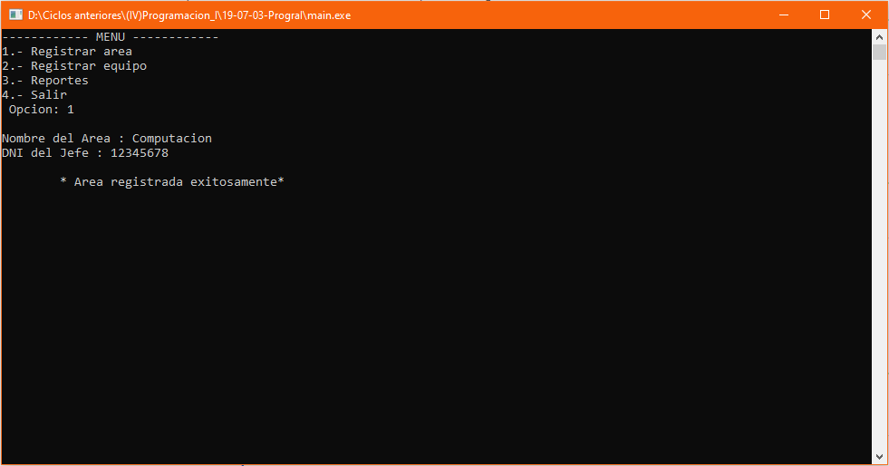
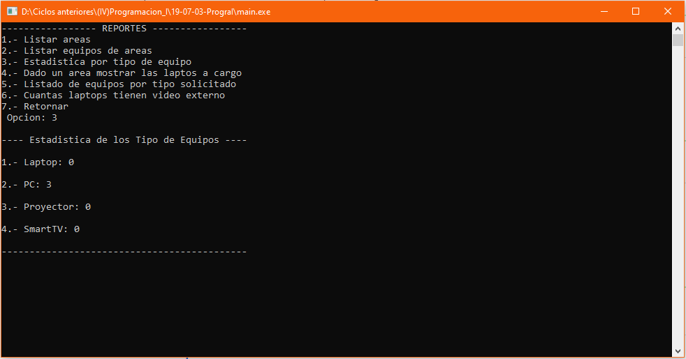

# Gestión de áreas
Sistema de gestión de áreas que permite registrar una área, registrar equipos en estas áreas registradas; en los reportes tenemos mostrar las áreas registradas, mostrar los equipos registrados en cada área, estadística por los tipos de equipos, según un área mostrar las laptops a cargo, listar los equipos según su tipo, cantidad de laptops que tiene tarjeta de video externa, **03/07/19**.

<strong>Imagen:</strong> Menú principal - Registrar área.

<strong>Imagen:</strong> Menú de reportes - Reporte 03.

